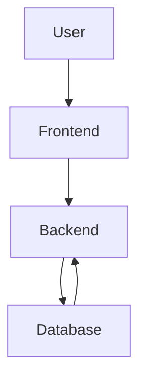

# CodeViz Research Context

> **Note**: This file contains research context from CodeViz. Most recent contexts are at the bottom.

---

## Research Query

Show me the arquitectural diagram

*Session: 05b17987000e75ac9cd18dcb6421ff30 | Generated: 7/7/2025, 10:17:04*

### Analysis Summary

# System Architecture Diagram

## High-Level Architecture

The system is composed of three main components: a **Frontend** application, a **Backend** API, and a **PostgreSQL Database**. These components are orchestrated using **Docker Compose** for containerization and deployment.

### **Frontend**

The **Frontend** is a React application responsible for the user interface and user interaction. It consumes APIs exposed by the **Backend** to fetch and send data.

*   **Purpose**: Provides the graphical user interface for users to interact with the online appointment booking system.
*   **Internal Parts**:
    *   **React Application**: The core of the frontend, defined in the [src/](frontend/src/) directory.
        *   [Pages](frontend/src/pages/): Contains different views and routes of the application (e.g., [Login](frontend/src/pages/Login.jsx), [BookingPage](frontend/src/pages/BookingPage.jsx), [Profile](frontend/src/pages/Profile.jsx)).
        *   [Components](frontend/src/components/): Reusable UI elements used across different pages (e.g., [ClientInfoCard](frontend/src/components/ClientInfoCard.jsx), [GeneralInfoCard](frontend/src/components/GeneralInfoCard.jsx)).
        *   [Services](frontend/src/services/): Modules responsible for making API calls to the backend (e.g., [apiClient](frontend/src/services/apiClient.js), [authService](frontend/src/services/authService.js), [appointmentService](frontend/src/services/appointmentService.js)).
    *   **Build Configuration**: Managed by [Vite](frontend/vite.config.js).
    *   **Dependencies**: Defined in [package.json](frontend/package.json).
    *   **Containerization**: Defined by [Dockerfile](frontend/Dockerfile).
*   **External Relationships**: Communicates with the **Backend** via HTTP requests to its API endpoints.

### **Backend**

The **Backend** is a Flask application that serves as the API for the frontend. It handles business logic, authentication, and interacts with the database.

*   **Purpose**: Provides the core business logic, API endpoints, and data management for the application.
*   **Internal Parts**:
    *   **Flask Application**: The main application instance is initialized in [app/__init__.py](backend/app/__init__.py) and run via [run.py](backend/run.py).
        *   [Models](backend/app/models/): Defines the database schema using SQLAlchemy ORM (e.g., [user](backend/app/models/user.py), [establishment](backend/app/models/establishment.py), [scheduling](backend/app/models/scheduling.py)).
        *   [Routes](backend/app/routes/): Implements the API endpoints for various functionalities (e.g., [auth](backend/app/routes/auth.py), [appointment](backend/app/routes/appointment.py), [establishment](backend/app/routes/establishment.py)).
        *   [Utils](backend/app/utils/): Contains utility functions like [tokens](backend/app/utils/tokens.py) for JWT handling.
    *   **Configuration**: Application settings are managed in [config.py](backend/config.py).
    *   **Database Migrations**: Handled by Alembic, configured in [migrations/alembic.ini](backend/migrations/alembic.ini) with migration scripts in [migrations/versions/](backend/migrations/versions/).
    *   **Dependencies**: Listed in [requirements.txt](backend/requirements.txt).
    *   **Containerization**: Defined by [Dockerfile](backend/Dockerfile).
*   **External Relationships**:
    *   Exposes RESTful API endpoints consumed by the **Frontend**.
    *   Connects to and performs operations on the **PostgreSQL Database**.

### **PostgreSQL Database**

The **PostgreSQL Database** is used for persistent storage of all application data.

*   **Purpose**: Stores all application data, including user information, establishment details, appointments, and services.
*   **Internal Parts**: Managed as a Docker service.
*   **External Relationships**: Accessed exclusively by the **Backend** application. Database logs are stored in [logs/postgres_citas_db.log](logs/postgres_citas_db.log).

## Deployment and Orchestration

The entire application stack (Frontend, Backend, and Database) is containerized and orchestrated using **Docker Compose**.

*   **Purpose**: Defines and runs the multi-container Docker application.
*   **Configuration**: The [docker-compose.yml](docker-compose.yml) file specifies the services, networks, and volumes required for the application to run. It defines how the frontend, backend, and database containers are built and linked together.

